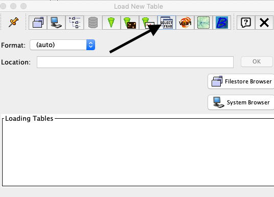
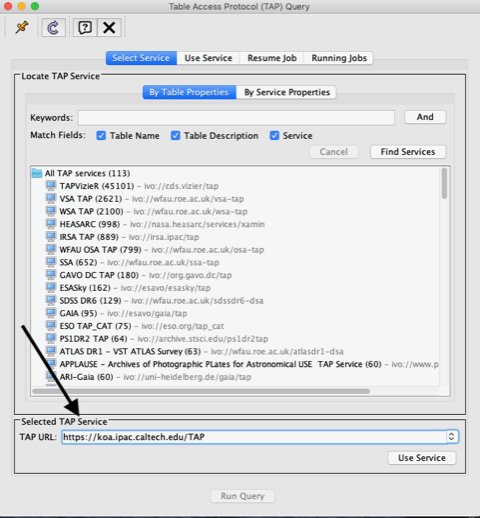
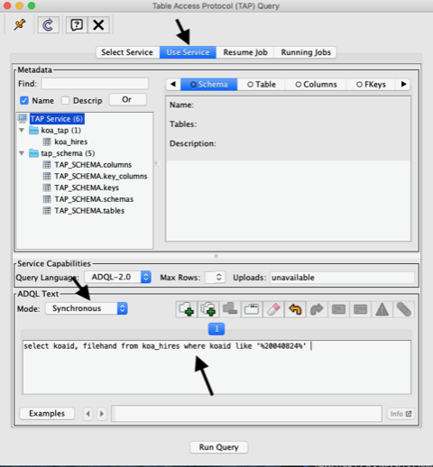

Notes on TAP Clients
====================

While it is possible to interact with the nexsciTAP server through a browser, wget, *etc.*, 
many users will prefer to use a small set of widely used clients.  We describe here the
interaction with three widely used clients: TAPPlus (or TAP+), PyVO and TOPCAT.  All three 
support sychronous and asychronous interaction with nexsciTAP. This page presents Jupyter 
notebooks describing this interaction to search for public data housed at the Keck Observatory 
Archive (KOA; https://koa.ipac.caltech.edu), though any compliant TAP server should work
equally well.

**Note:** Protected (user-proprietary) data at KOA are currently inaccessible through 
through these clients, as they do not support the security cookies required to access 
private data at KOA).

**TAPPlus (TAP+)**. A part of the Python Astroquery package, TAPPlus is a general Python
library for accessing TAP services that is maintained at the ESAC Space Data Centre
(ESDC: http://www.cosmos.esa.int/web/esdc/) . In synchronous mode, the package imposes a
hard-coded limit on the return of 2000 records.

Jupyter notebooks to access KOA data:

TAP+/asynchronous (https://github.com/Caltech-IPAC/nexsciTAP/blob/develop/Jupyter/Using%20nexsciTAP%20with%20TAP+%20to%20perform%20asynchronous%20queries%20on%20KOA%20data.ipynb)

HTML (https://github.com/Caltech-IPAC/nexsciTAP/blob/develop/Jupyter/Using%20nexsciTAP%20with%20TAP+%20to%20perform%20asynchronous%20queries%20on%20KOA%20data.html)

-

TAP+/synchronous (https://github.com/Caltech-IPAC/nexsciTAP/blob/develop/Jupyter/Using%20nexsciTAP%20with%20TAP+%20to%20perform%20synchronous%20queries%20on%20KOA%20data.ipynb)

HTML (https://github.com/Caltech-IPAC/nexsciTAP/blob/develop/Jupyter/Using%20nexsciTAP%20with%20TAP+%20to%20perform%20synchronous%20queries%20on%20KOA%20data.html)

-

PyVO/asynchronous (https://github.com/Caltech-IPAC/nexsciTAP/blob/develop/Jupyter/Using%20nexsciTAP%20with%20PyVO%20to%20perform%20asynchronous%20queries%20on%20KOA%20data.ipynb)

HTML (https://github.com/Caltech-IPAC/nexsciTAP/blob/develop/Jupyter/Using%20nexsciTAP%20with%20PyVO%20to%20perform%20asynchronous%20queries%20on%20KOA%20data.html)

-

PyVO/synchronous (https://github.com/Caltech-IPAC/nexsciTAP/blob/develop/Jupyter/Using%20nexsciTAP%20with%20PyVO%20to%20perform%20synchronous%20queries%20on%20KOA%20data.ipynb)

HTML (https://github.com/Caltech-IPAC/nexsciTAP/blob/develop/Jupyter/Using%20nexsciTAP%20with%20PyVO%20to%20perform%20synchronous%20queries%20on%20KOA%20data.html)

**PyVO**. PyVO (https://github.com/astropy/pyvo) is a Python package that provides access 
to remote data and VO-compliant services.

(Jupyter notebook to access KOA data)

(web version of Jupyter  notebook to access KOA data)

**TOPCAT** TOPCAT (http://www.star.bris.ac.uk/~mbt/topcat/) is an interactive graphical
viewer and editor for tabular data. It provides most of the facilities that astronomers
need for analysis and manipulation of source catalogues and other tables. It is a stand-alone
Java application that uses Virtual Observatory (VO) standards to access and integrate 
distributed data.

The screenshots below show how to call nexsciTAP from TOPCAT. Download the jar file from the 
TOPCAT web site and open the application.

1. Select "Load Table "  from the file menu and then choose "Select From ":

2. At the bottom of the window, enter the URL of the TAP service and click "Use Service"

3. In the Use Service tab, enter the SQL query in the window near the bottom and hit "Run Query":

4.  When the query has run, you will see a window that reports the status of the query:

.. image:: images/Figure4.png
  :alt: Calling nexsciTAP from TOPCAT (4)

5. Double click on a table in Table List on the left side of the window to visualize the table:

.. image:: images/Figure5.png
  :alt: Calling nexsciTAP from TOPCAT (5)

6. Now you are ready to analyze the results in TOPCAT.

**Note:** If you get a "metadata not found" message when you run the query,
Select "VO-> Table Service Access Protocol" from the TOPCAT main menu, then 
Select "TAP -> Metadata Acquisition -> TAP_SCHEMA-C"

